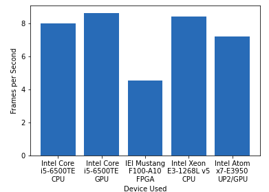
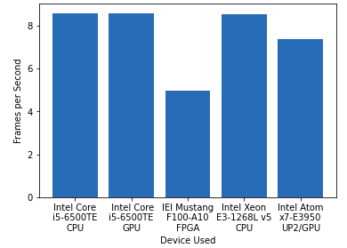

# Computer Pointer Controller

Project GitHub Link:- https://github.com/abhik-99/Mouse-Pointer-Tracker

Computer Pointer Controller is a project implemented using Intel OpenVINO that utlizes face detection, head pose estimation and gaze estimation from the face detected to control the  movements of the mouse pointer. The input to the **src/main.py** file can be a video. A sample video has been provided in the bin directory. Please refer to the Directory Structure for more information.

**Author**: Abhik Banerjee

**Contact**: abhik@abhikbanerjee.com, abhik.banerjee.1999@gmail.com

**Profile**:

LinkedIn:- [](https://www.linkedin.com/in/banerjee-1331/)

Intel Dev Community:- [](https://community.intel.com/t5/user/viewprofilepage/user-id/114753)

**Date Of Submission**: 10th July, 2020.

**Language Used**: Python 3.8

**Intel OpenVINO**: 2020.3

**Required Packages**:
(mentioned in requirements.txt)
```
image==1.5.27
ipdb==0.12.3
ipython==7.10.2
numpy==1.17.4
Pillow==6.2.1
requests==2.22.0
virtualenv==16.7.9
pyautogui
```

## Directory Structure

The complete directory structure can be browsed [](./directory_structure.txt) 

Given below is the brief directory structure of the project.

```
|- bin                                       # stores the demo files
|   |- demo.mp4
|
|- env                                       # was used as virtual environment for isolation
|
|- images                                    # images referenced in the README.md
|
|- IR                                        # (not present in submission)contains the Intermediate Representation of the preferred precision
|
|- src                                       # source directory for code files
|   | - main.py                              # This file needs to run for testing/demo-ing the project
|   | - face_detection.py                    # Model Specific Wrapper Class files derived from provided model.py artifact
|   | - facial_landmarks_detection.py        # and then adapted as per the network to be used with.
|   | - gaze_estimation.py
|   | - head_pose_estimation.py
|   | - input_feeder.py                      # This is used to capture the feed from either video or camera.
|   | - mouse_controller.py                  # Abstraction file for controlling the mouse pointer on screen.
|
| directory_structure.txt
| output.mp4
| README.md
| requirements.txt
```

## Project Set Up and Installation

1. Clone the project from the GitHub Repo.

2. Use ```pip``` to install from the requirements.txt in the project root.

3. Make a Virtual ENV for running the project. (The Virtual Environment ```env``` was used for developmental purposes.) 

4. Make sure that you have setup the environment variable by running:

```
source /opt/intel/openvino/bin/setupvars.sh
```

5. Run the *main.py* in the *src* directory.

## Demo

Watch the Output of the project at this link:

[](https://youtu.be/2Mq5B725Z8I "Project Demo")

In the project Root directory, run the following command.

```
python src/main.py -i bin/demo.mp4 -fd IR/intel/face-detection-adas-binary-0001/FP32-INT1/face-detection-adas-binary-0001.xml -fl IR/intel/landmarks-regression-retail-0009/FP16/landmarks-regression-retail-0009.xml -hp IR/intel/head-pose-estimation-adas-0001/FP16/head-pose-estimation-adas-0001.xml -ge IR/intel/gaze-estimation-adas-0002/FP16/gaze-estimation-adas-0002.xml -flags fd ge hp fld
```

## Documentation

Pipeline of the Models Used:
[](./images/pipelin.png)

The following are the arguments that can be passed to the **src/main.py** file.

```
main.py [-h] -i INPUT -fd FACE_DETECTION_MODEL -fl               FACIAL_LANDMARK_MODEL -hp HEAD_POSE_MODEL -ge               GAZE_ESTIMATION_MODEL
               [-flags PREVIEW_FLAGS [PREVIEW_FLAGS ...]] [-l CPU_EXTENSION]
               [-pt PROB_THRESHOLD] [-d DEVICE] [-o OUTPUT_FILE] [-z ZOOMED]

This is the main file to control the mouse pointer from the video input.
Please execute it with the arguments.

optional arguments:
  -h, --help            show this help message and exit
  -i INPUT, --input INPUT
                        Path to video file or enter cam for webcam
  -fd FACE_DETECTION_MODEL, --face_detection_model FACE_DETECTION_MODEL
                        Path to .xml file of Face Detection model.
  -fl FACIAL_LANDMARK_MODEL, --facial_landmark_model FACIAL_LANDMARK_MODEL
                        Path to .xml file of Facial Landmark Detection model.
  -hp HEAD_POSE_MODEL, --head_pose_model HEAD_POSE_MODEL
                        Path to .xml file of Head Pose Estimation model.
  -ge GAZE_ESTIMATION_MODEL, --gaze_estimation_model GAZE_ESTIMATION_MODEL
                        Path to .xml file of Gaze Estimation model.
  -flags PREVIEW_FLAGS [PREVIEW_FLAGS ...], --preview_flags PREVIEW_FLAGS [PREVIEW_FLAGS ...]
                        Accepted values - 'fd' for Face Detection, 'fld' for
                        Facial Landmark Detection,'hp' for Head Pose
                        Estimation, 'ge' for Gaze Estimation.This option will
                        help you see the individual output from the model.
                        eg:- -flags fld hp
  -l CPU_EXTENSION, --cpu_extension CPU_EXTENSION
                        Path to the CPU Extension
  -pt PROB_THRESHOLD, --prob_threshold PROB_THRESHOLD
                        Probability threshold for model to detect the face
                        accurately from the video frame.
  -d DEVICE, --device DEVICE
                        The target device to infer on: CPU, GPU, FPGA or
                        MYRIAD is acceptable. Sample will look for a suitable
                        plugin for device specified (CPU by default). Please
                        note that only CPU is available in Author's
                        Workstation
  -o OUTPUT_FILE, --output_file OUTPUT_FILE
                        If specified, then the output file by the name
                        'output.<extension>'is generated in the ./src
                        directory. This file shows the detection
                        output.Accepted Values:- [y(default), n]. Please note
                        that this option is only available for Linux at the
                        moment.
  -z ZOOMED, --zoomed ZOOMED
                        If True then displays only the cropped face in the
                        video. The output file, however, shows full image.
```

## Benchmarks
The following benchmarks were obtained using the hardwares given below:
1. Intel Core i5-6500TE CPU
2. Intel Core i5-6500TE GPU
3. IEI Mustang F100-A10 FPGA
4. Intel Xeon E3-1268L v5 CPU
5. Intel Atom x7-E3950 UP2 GPU

### INT8

#### FPS

[](./images/fps_int8.png)

#### Inference Time

[](./images/inference_time_int8.png)

#### Model Loading Time

[](./images/model_loading_time_int8.png)

### FP16

#### FPS

[](./images/fps_fp16.png)

#### Inference Time

[](./images/inference_time_fp16.png)

#### Model Loading Time

[](./images/model_loading_time_fp16.png)

### FP32

#### FPS

[](./images/fps_fp32.png)

#### Inference Time

[](./images/inference_time_fp16.png)

#### Model Loading Time

[](./images/model_loading_time_fp32.png)


## Results

As can be observed from the benchmarks, the Model Loading Time of CPUs is the least in all cases and that of FPGAs are most. This is because FPGAs are use case specific as such a configuration which is adopted into the FPGA is meant to last. However, CPUs, while being slow in terms of compute, can load different instruction sets faster. In case of FPS, the NCS outperforms all other hardwares tested on. The GPU is shown to have poor performance. The CPUs offer a moderate performance with Intel Core i5 6th Gen being better. 
It is advisable to use FP16 on Edge Devices requiring higher accuracy. INT8 offers even faster results however this may lead to drop in terms of accuracy. FP32 is a poor fit on edge devices. In the same vector space, FP16 precision can help perform double the number of floating point operations. It, thus, offers a good balance between precisions.
### Edge Cases

In case of presence of multiple faces in the frame, only the first detected face is used. Since there might be change in the person whose face is detected, a constant target of "using just the first detection" is preferable. Moreover, a default probability threshold helps in removing false detections.
